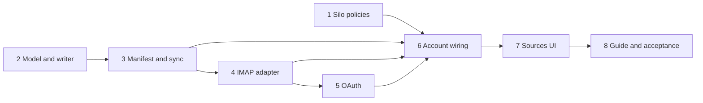

# Email Mirror: Implementation Overview

Status: ready to implement · Branch: `develop` · Last updated: 2026-09-06

## What this feature is

Mirror selected email into local Markdown files, one file per message, inside a read-only
Lodestone silo per mailbox. The existing watcher, chunker, embedder and ranker index the mirror
like any other folder, so email hits appear in the same ranked result set as files and
`lodestone_read` returns a message like any note. No new MCP tools.

All mailboxes are reached over IMAP. Microsoft 365 mailboxes authenticate with XOAUTH2 using
Thunderbird's registered client ID, which both target tenants have been verified to accept.

The full design is in [design.md](design.md). Read it once before starting any phase; each phase
doc assumes it and only repeats the parts it needs.

## Phases

Each phase is independently mergeable and leaves the app working. Later phases depend on earlier
ones as shown.

| Phase | Doc | Delivers | Depends on |
|---|---|---|---|
| 1 | [phase-01-silo-policies.md](phase-01-silo-policies.md) | `read_only`, `managed`, `supports_path_search`, `available`, index-caught-up signal, enforcement on every write route | none |
| 2 | [phase-02-message-model-and-writer.md](phase-02-message-model-and-writer.md) | `src/backend/mail/` message model, body-part chooser, Markdown writer, filename hashing | none |
| 3 | [phase-03-manifest-and-synchroniser.md](phase-03-manifest-and-synchroniser.md) | manifest SQLite, adapter interface, fake adapter, round-based synchroniser with crash-point tests | 2 |
| 4 | [phase-04-imap-adapter.md](phase-04-imap-adapter.md) | ImapFlow adapter with password auth, Gmail handling, command allowlist | 2, 3 |
| 5 | [phase-05-oauth-credentials.md](phase-05-oauth-credentials.md) | OAuth code flow, refresh, XOAUTH2, `safeStorage` credential store | 4 |
| 6 | [phase-06-account-wiring.md](phase-06-account-wiring.md) | `[mail_accounts.*]` config, account registry, scheduler, managed silo registration, removal, IPC | 1, 3, 4, 5 |
| 7 | [phase-07-sources-ui.md](phase-07-sources-ui.md) | Add source flow, email form, account card, settings, remove | 6 |
| 8 | [phase-08-guide-and-acceptance.md](phase-08-guide-and-acceptance.md) | `lodestone_guide` text, manual acceptance pass | 7 |

Phases 1 and 2 have no dependencies and can be done in either order or in parallel. Phase 2
through 5 are pure backend work under `src/backend/mail/` with no wiring into the running app
until phase 6, so they can be developed and tested in isolation with `vitest`.

## Conventions for every phase

- Branch from `develop`, one branch per phase, merge back when the phase's done criteria pass.
- New code lives under `src/backend/mail/` unless the phase says otherwise. Nothing under
  `src/backend/mail/` may import from `src/renderer/` or `src/main/`.
- The read-only guarantee is structural. Do not add any IMAP command outside the allowlist in
  [design.md](design.md#adapter), and do not add a code path that writes into a mirror directory
  outside the synchroniser and account removal.
- Logs identify accounts by `account_hash`, never by address, and never contain subjects, bodies,
  tokens or passwords. This applies from phase 3 onwards.
- Tests are `vitest`, colocated as `*.test.ts`. Integration tests that need a real mailbox read
  credentials from environment variables and skip when they are absent.
- Node is pinned in `.nvmrc`; see the `//engines` note in `package.json` before packaging.

## Decisions taken while splitting the design into phases

These refine the design note without changing its intent.

- Account settings (host, port, username, credential kind, client ID, selection, cutoff, timer)
  live in `config.toml` under `[mail_accounts.<account_hash>]`, alongside the existing
  `[silos.*]` section, because that is where Lodestone keeps user-editable configuration. The
  manifest holds only runtime state (rounds, `UIDVALIDITY`, sync state, file mappings).
- The mirror silo is an ordinary `[silos.<name>]` entry with three new keys: `read_only = true`,
  `supports_path_search = false`, and `managed_by = "mail:<account_hash>"`. Marking it this way
  means the existing silo loader, watcher and indexer need no mail-specific code.
- Read-only enforcement is checked in the GUI process (`internal-api.ts` `handleEdit`), from the
  GUI's own silo configuration, not from the `siloDirectories` list the MCP bridge sends over the
  pipe. The bridge-supplied list stays as the boundary check it is today.
- `available` is a runtime flag on `SiloManager`, not a config key. The mail module sets it; the
  MCP bridge learns it through `status()`.
