# Resource-Oriented Architecture Plan

Status: draft · Branch: `develop` · Last updated: 2026-06-21

## Purpose

Lodestone is moving from "filesystem silos that contain files" toward "silos that contain
addressable resources". Workflowy is the forcing function, but the architecture should be general
enough that future sources do not have to impersonate files.

The evolved idea is a broader resource-oriented
model:

- A **silo** is a named data source.
- A silo declares the **resource types** it may contain.
- A **resource type** defines how resources are addressed, indexed, chunked, searched, read, and
  mutated.
- A **resource address** identifies a resource without assuming it lives on a filesystem.
- Search, PUIDs, read, edit, and MCP formatting route through resource addresses.

The implementation can and should be broken into many small chunks, but the target design should
be explicit before Workflowy is added.

## Why This Refactor Exists

The current system has several file-shaped assumptions:

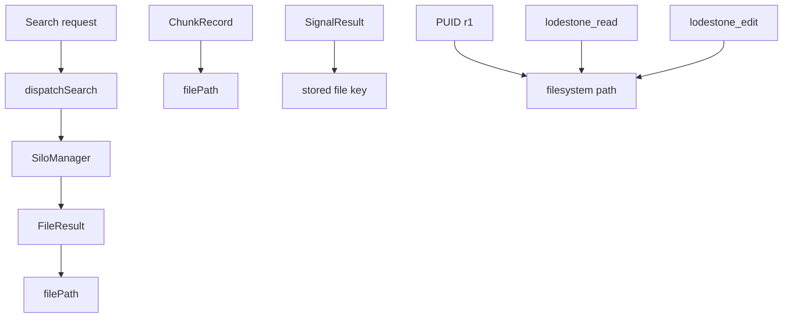

Those assumptions are coherent for filesystem silos. They become wrong for Workflowy:

- A Workflowy hit is a node, not a file.
- A Workflowy node is addressed by a node ID, not a path.
- Reading a Workflowy hit may mean returning a node subtree, not file bytes or line ranges.
- Editing a Workflowy hit may mean patching node text, note HTML, parentage, completion state, or
  ordering.
- Staleness, sync, and conflict behavior differ from filesystem watchers.

The goal is not merely "let Workflowy appear in search". The goal is to make Lodestone's internal
model match what it is actually becoming.

## Target Vocabulary

### Silo

A silo is a named data source. It owns a set of resources and declares which resource types may
appear inside it.

Examples:

- Filesystem silo
- Workflowy silo
- Future GitHub silo
- Future browser/bookmark silo
- Future database/document-store silo

### Resource

A resource is an addressable thing inside a silo.

Examples:

- Markdown file
- TypeScript file
- PDF file
- Plaintext file
- Workflowy node

### Resource Type

A resource type defines behavior for a class of resources:

- how to identify the resource
- how to extract text or structured content
- how to chunk it for indexing
- how to read all or part of it
- how to create, update, move, or delete it, if supported
- how to format it for MCP and UI results

### Resource Address

A resource address is the durable internal pointer to a resource. It replaces "filepath" as the
universal identifier.

Examples:

```ts
type ResourceAddress =
  | { kind: 'file'; siloName: string; filePath: string }
  | { kind: 'workflowy-node'; siloName: string; nodeId: string };
```

### Resource Location

A resource location identifies a smaller part of a resource. This is the generalization of today's
`LocationHint`.

Examples:

- file line range
- PDF page
- Workflowy node subtree
- Workflowy child index range
- a chunk ID inside any indexed resource

### Chunk

A chunk is the unit Lodestone indexes and embeds. Chunks should point back to resource addresses
and resource locations, not only to file paths.

### Search Signal

A search signal scores resources or chunks on a `[0, 1]` scale.

Existing signals:

- semantic/vector
- BM25
- regex
- filepath

Future signals may be resource-specific. For example, Workflowy may eventually have a breadcrumb
signal, completion-state filter, or sibling/ancestor context signal.

### PUID

A PUID is a session-scoped user-facing reference. It should point to a resource address, not a
filesystem path.

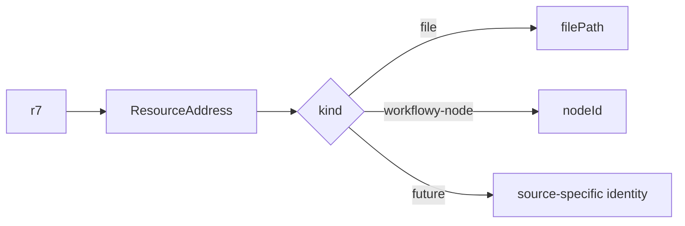

## Target Architecture

At the highest level, Lodestone should route operations through silos and resource types:

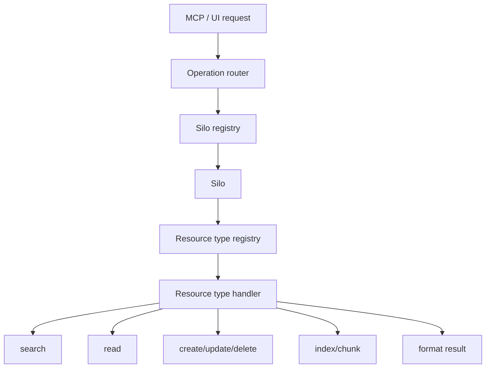

A silo declares its possible resource types:

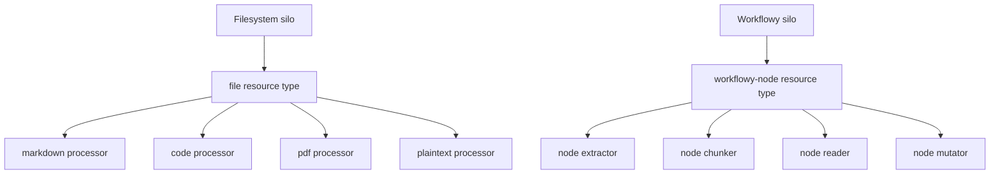

The model separates storage/source concerns from resource behavior:

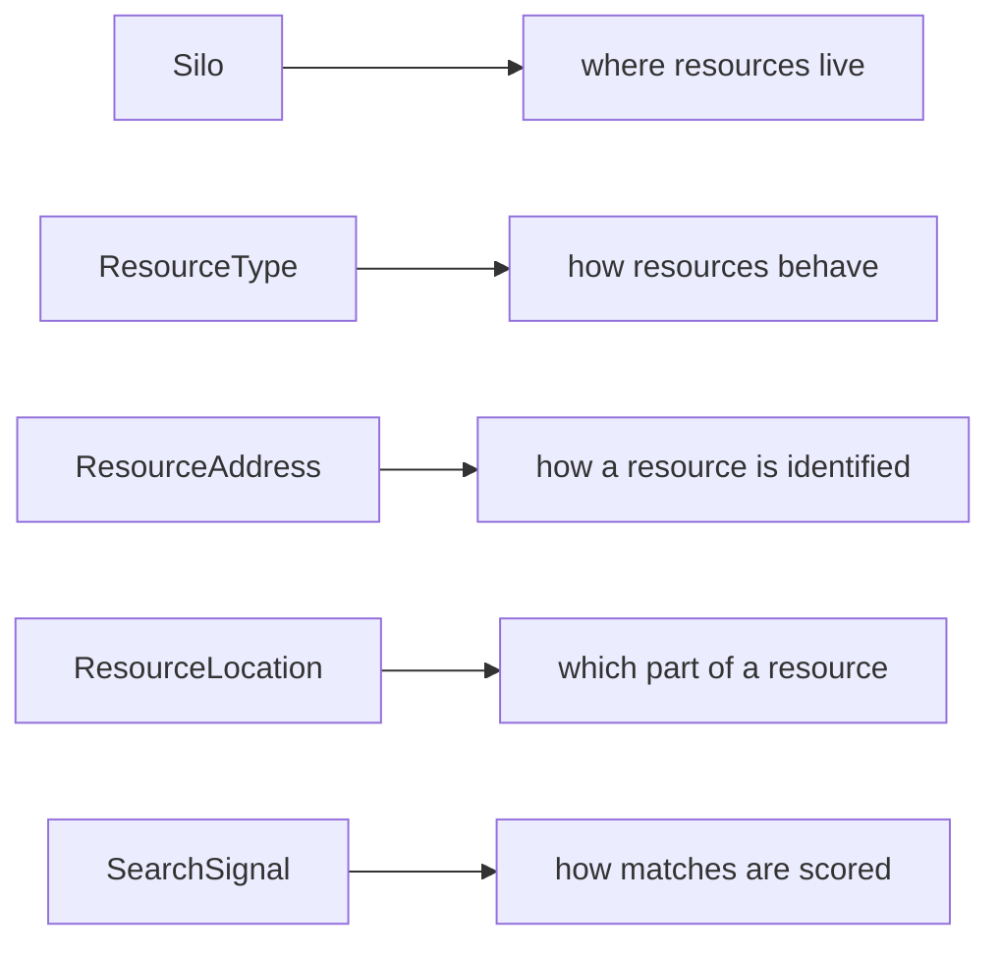

## Type Sketch

These are not final implementation types. They are meant to clarify the architectural shape.

```ts
export type SiloKind = 'filesystem' | 'workflowy';

export interface Silo {
  name: string;
  kind: SiloKind;
  resourceTypes: ResourceType[];
  capabilities: SiloCapabilities;
  status(): Promise<SiloStatus>;
}

export interface SiloCapabilities {
  search: boolean;
  read: boolean;
  create: boolean;
  update: boolean;
  delete: boolean;
  explore: boolean;
  sync: boolean;
}
```

Resource addresses should be discriminated unions:

```ts
export interface BaseResourceAddress {
  kind: string;
  siloName: string;
}

export interface FileAddress extends BaseResourceAddress {
  kind: 'file';
  filePath: string;
}

export interface WorkflowyNodeAddress extends BaseResourceAddress {
  kind: 'workflowy-node';
  nodeId: string;
}

export type ResourceAddress = FileAddress | WorkflowyNodeAddress;
```

Locations should also be source-neutral:

```ts
export type ResourceLocation =
  | { kind: 'full' }
  | { kind: 'lines'; start: number; end: number }
  | { kind: 'page'; page: number }
  | { kind: 'workflowy-subtree'; rootNodeId: string; depth?: number }
  | { kind: 'chunk'; chunkId: string };
```

Resource types should own behavior:

```ts
export interface ResourceType<
  TAddress extends ResourceAddress = ResourceAddress,
  TLocation extends ResourceLocation = ResourceLocation,
> {
  kind: TAddress['kind'];
  canHandle(address: ResourceAddress): address is TAddress;

  extract?(resource: TAddress): Promise<ExtractionResult>;
  chunk?(resource: TAddress, extraction: ExtractionResult): Promise<ResourceChunk[]>;
  read?(resource: TAddress, location?: TLocation): Promise<ResourceReadResult>;
  create?(target: TAddress, content: ResourceWriteInput): Promise<ResourceMutationResult>;
  update?(target: TAddress, patch: ResourcePatch): Promise<ResourceMutationResult>;
  delete?(target: TAddress): Promise<ResourceMutationResult>;
}
```

Search results should carry common ranking fields plus an address:

```ts
export interface SearchResultBase {
  kind: string;
  siloName: string;
  address: ResourceAddress;
  displayLabel: string;
  score: number;
  scoreLabel: string;
  signals: Record<string, number>;
  hint?: SearchHint;
  chunks?: ChunkHint[];
}

export interface FileSearchResult extends SearchResultBase {
  kind: 'file';
  address: FileAddress;
}

export interface WorkflowySearchResult extends SearchResultBase {
  kind: 'workflowy-node';
  address: WorkflowyNodeAddress;
  childCount?: number;
  breadcrumb?: string[];
}

export type ResourceSearchResult = FileSearchResult | WorkflowySearchResult;
```

## Search Architecture

Search should operate over resources, not files.

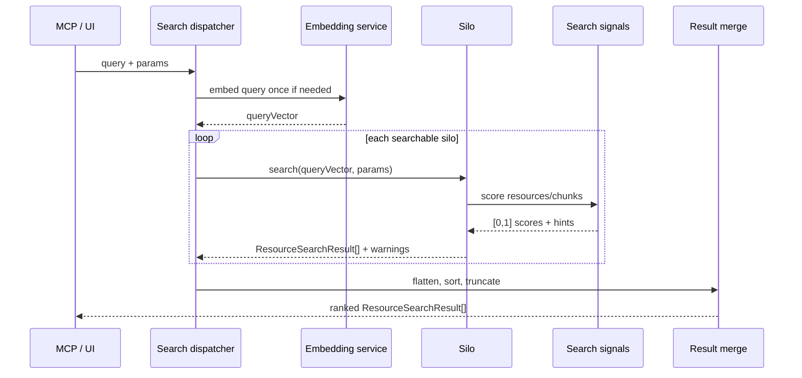

Search signals should eventually stop assuming `stored_key` means "file". The general scoring
contract should be "resource key to score", where the key resolves to a `ResourceAddress`.

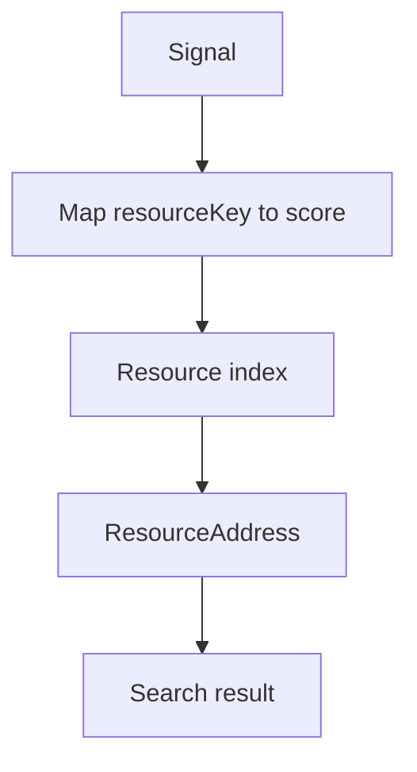

## Chunking And Indexing

The existing extractor/chunker/reader pipeline is already close to a resource-type handler, but
it is scoped to files. The refactor should preserve the useful shape while replacing file-specific
identity.

Current:


Target:


Sketch:

```ts
export interface ResourceChunk {
  address: ResourceAddress;
  chunkIndex: number;
  text: string;
  location: ResourceLocation;
  sectionPath?: string[];
  contentHash: string;
}
```

Filesystem resources can initially remain one broad `file` resource type with extension-specific
processors underneath:

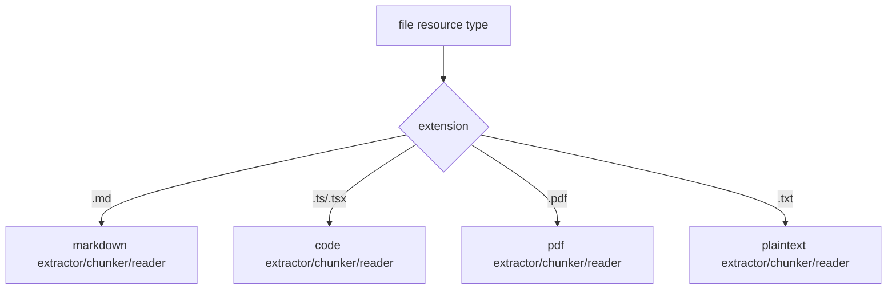

That avoids unnecessary churn while still moving the outer architecture away from file-only
assumptions.

## Read Architecture

`lodestone_read` should resolve a PUID or raw address to a `ResourceAddress`, then route to the
owning silo/resource type.

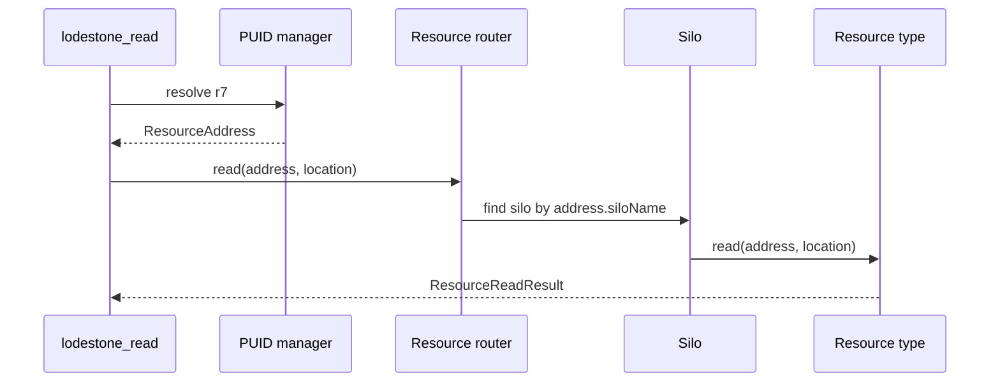

File reads continue to support full file, line ranges, PDF pages, and images. Workflowy reads can
return a node, a subtree, or a selected location within a node.

## Mutation Architecture

Create, update, move, and delete should also route through resource addresses. Different resource
types can expose different mutation capabilities.

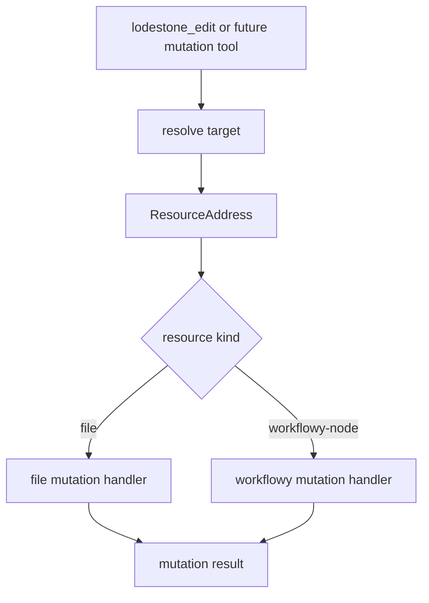

This does not mean every resource type supports every operation. The capability model should make
unsupported operations explicit and return useful errors.

Examples:

- Files may support create, overwrite, append, rename, move, delete.
- Workflowy nodes may support create child, update node body, move node, complete/uncomplete,
  delete node.
- PDFs may be readable and searchable but not directly editable.

## PUID Architecture

`PuidRecord` should become a discriminated union:

```ts
export type PuidRecord =
  | {
      kind: 'file';
      address: FileAddress;
      contentHash?: string;
      invalidated?: boolean;
      invalidatedLabel?: string;
    }
  | {
      kind: 'workflowy-node';
      address: WorkflowyNodeAddress;
      label: string;
      contentHash?: string;
      invalidated?: boolean;
      invalidatedLabel?: string;
    };
```

Deduplication should be address-specific:

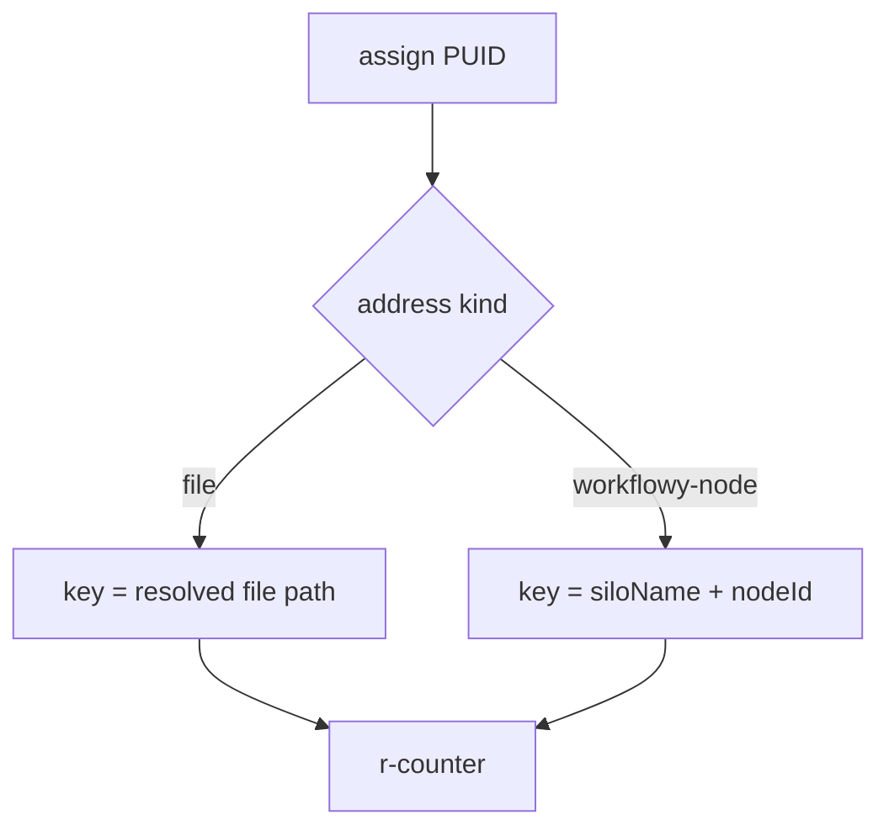

`r*` references should cover readable resources. `d*` references can stay directory-specific until
there is a real non-filesystem equivalent.

## MCP And UI Presentation

Search result presentation should be based on `kind` and `displayLabel`, not `filePath`.

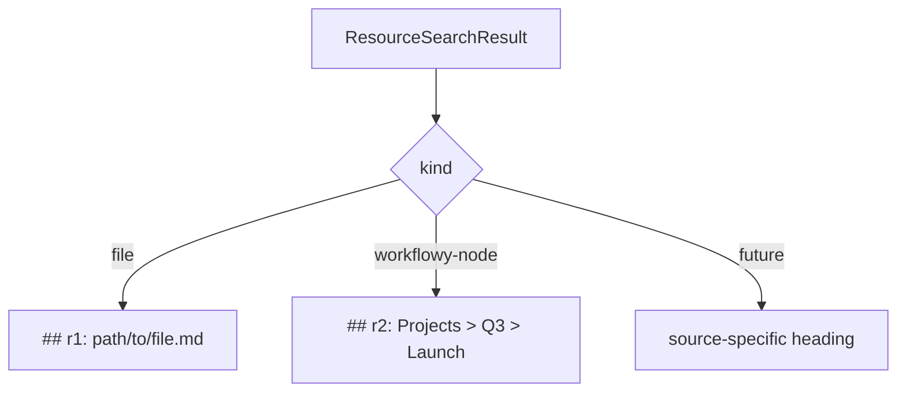

Shared fields:

- PUID
- silo/source label
- score
- score label
- signal breakdown
- chunk/location hints
- warning block

Kind-specific fields:

- file path
- Workflowy breadcrumb
- Workflowy child count
- source-specific metadata

## Silo Status And Capabilities

Filesystem silos and Workflowy silos will have different lifecycle semantics.

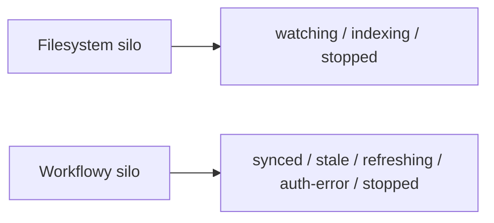

The UI and MCP status surfaces should avoid assuming all silos are file watchers. A shared status
shape can expose common fields plus kind-specific details.

```ts
export interface SiloStatus {
  name: string;
  kind: SiloKind;
  state: string;
  searchable: boolean;
  warnings?: string[];
  details?: Record<string, unknown>;
}
```

## Open Design Decisions

### One File Resource Type Or Many?

Option A: one broad `file` resource type with extension-specific processors underneath.

- Lower churn.
- Matches the current extractor/chunker/reader registry.
- Keeps filesystem migration smaller.
- Still gives non-file resources a clean abstraction.

Option B: separate resource types like `markdown-file`, `code-file`, `pdf-file`.

- More explicit.
- Lets capabilities differ by file type.
- Could be cleaner long term.
- Requires more migration work and may over-model the filesystem too early.

Current leaning: start with one broad `file` resource type, keep extension processors underneath,
and split later only if a real capability difference demands it.

### Is `SearchSource` Still A Thing?

Probably yes, but as a capability of a silo rather than the main abstraction.

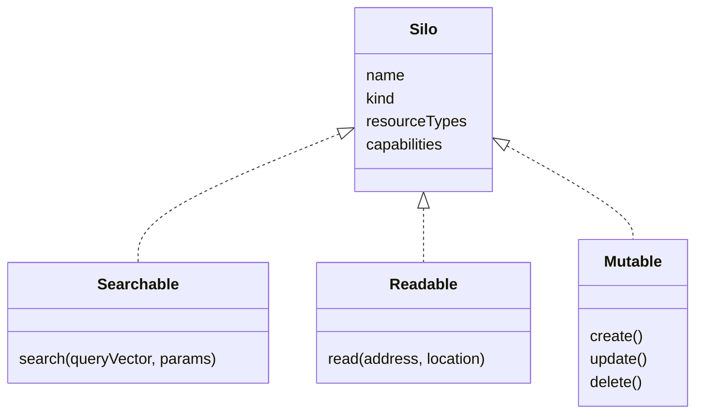

### Should Signals Be Global Or Resource-Type Specific?

Some signals are broadly applicable:

- semantic/vector
- BM25
- regex over chunk text

Some are resource-specific:

- filepath
- Workflowy breadcrumb
- maybe future graph/link signals

The search runner should allow modes to choose only the signals that are valid for a silo/resource
type. A source should not have to implement meaningless signals just to fit a global mode.

### How Far Should CRUD Generalization Go?

Search and read must be generalized before Workflowy search can be clean. Mutation can follow,
but the design should not paint it into a corner.

The resource type interface should include mutation concepts even if the first implementation only
migrates file mutations and leaves Workflowy mutations for a later chunk.

## Identity And Index

The rest of this document treats `ResourceAddress` as the spine and describes routing around it.
Two questions sit underneath that spine and must be answered before Chunk 1, because they decide
whether the early chunks are a rename or a rebuild. The sketches above quietly assume an answer to
both; this section makes the answers explicit.

### Decision 1: What A `FileAddress` Holds

The codebase does not have one file identity. It has two, living in different layers:

- **`stored_key`** — silo-relative, formatted `"{dirIndex}:{relPath}"` (e.g. `0:src/backend/store.ts`).
  Used by search, every signal, and the SQLite schema. Produced by `makeStoredKey`, reversed by
  `resolveStoredKey`, both of which require the silo's `indexedDirectories` array as context.
- **absolute path** — used by the PUID manager, `lodestone_read`, and `lodestone_edit`. These layers
  currently have **no silo awareness at all**: they resolve `r7` straight to an absolute path and call
  `fs.statSync` / `processor.reader(filePath, …)` on it.

`FileAddress = { kind: 'file'; siloName; filePath }` has to commit to one meaning of `filePath`, and
the two layers want opposite things. The choice is not cosmetic:

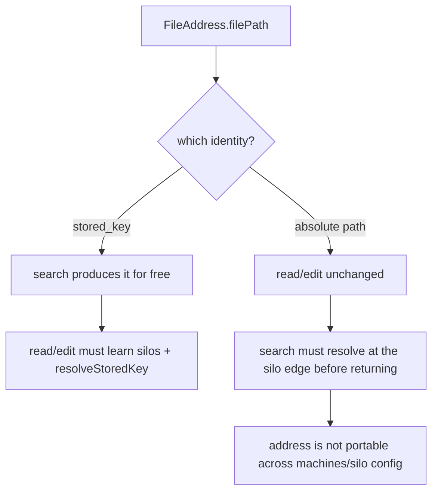

**Recommendation: a `FileAddress` carries silo-relative identity, and absolute-path resolution lives
at the silo edge.**

```ts
export interface FileAddress extends BaseResourceAddress {
  kind: 'file';
  siloName: string;
  storedKey: string; // "{dirIndex}:{relPath}" — NOT an absolute path
}
```

Rationale:

- It is the only identity that is portable and silo-scoped. An absolute path silently assumes a single
  filesystem and a fixed `indexedDirectories` order; a Workflowy node has no absolute path at all, so
  picking "absolute path" as the universal field re-introduces the exact file assumption this refactor
  is removing.
- It matches where identity already lives. The DB, the chunk records, and all four signals are already
  keyed on `stored_key`; only the PUID/read/edit tail uses absolute paths.
- The cost is honest and localized: **read and edit must be taught silos.** Resolving an address to
  bytes becomes `silo.resolve(address) → absolute path` (via `resolveStoredKey` for filesystem silos),
  performed by the owning silo, not by the tool. This is the main reason **Chunk 5 (Read Routing) is
  larger than its one-line description implies** — it is not just "route through an address", it is
  "give the read path a silo it can ask for resolution."

Consequence for PUIDs: the PUID dedup key for files becomes `siloName + storedKey`, not the absolute
path. The current absolute-path dedup (`filePathToPuid`) and the path-prefix invalidation
(`invalidateByPathPrefix`) must be re-expressed against addresses. The watcher still emits absolute
paths, so the silo edge must map an absolute path back to a `storedKey` to invalidate — `makeStoredKey`
already does this.

### Decision 2: One Resource Schema Or Many

Signals are not merely coupled to the *name* `stored_key`. They run raw SQL against a specific,
file-shaped schema — `SELECT stored_key FROM files`, `JOIN files f ON f.id = c.file_id`, columns
`file_name` and `mtime_ms`. Renaming the key does nothing if the table shape stays file-only.

The mitigating fact: **indexes are already per-silo.** Each silo owns its own SQLite database, and a
`SignalContext` holds exactly one silo's `db`. A Workflowy silo therefore gets its own database file no
matter what — the question is not "do nodes share the files table" but "**does every silo's database
conform to one resource schema, or does each silo kind define its own?**"

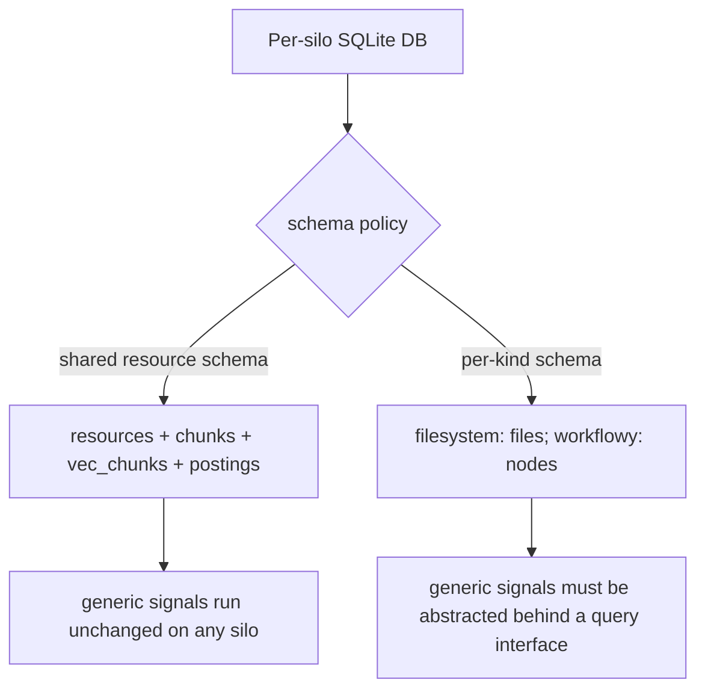

**Recommendation: one shared resource schema, with source-specific fields pushed into a JSON column.**

Concretely, generalize the existing tables rather than fork them:

- `files` → `resources`, with `stored_key` → `resource_key` (still `TEXT UNIQUE NOT NULL`, still the
  grouping identity every signal uses). `file_name` → `display_label`. `mtime_ms` becomes nullable and
  joins `file_metadata` under one `source_metadata TEXT` JSON column — Workflowy staleness (node
  version, last-sync) lives there without new columns.
- `chunks`, `vec_chunks`, `postings`, `terms` are **already resource-neutral** — they key on `file_id`
  / `chunk_id` integers and store text + embeddings. Only the foreign-key name (`file_id` →
  `resource_id`) changes. This is the cheap part and confirms the doc's instinct that the chunk
  pipeline is already close.

Rationale:

- It is what keeps semantic / BM25 / regex **genuinely global** instead of aspirationally global. Those
  three signals only need "rows with a `resource_key`, joined to chunks with text and embeddings." If
  every silo's DB presents that shape, they run verbatim across filesystem and Workflowy with zero
  per-source code. That is the single biggest payoff available in this refactor and it is purchased
  almost entirely by a rename.
- Source-specific signals (filepath, future Workflowy breadcrumb) stay opt-in per the "signals global
  or resource-type specific" decision — the filepath signal simply does not run on a silo whose
  `resource_key` is not a path. The shared schema does not force a source to implement a meaningless
  signal; it only guarantees the *generic* ones have a table to read.
- The alternative (per-kind schemas) forces an abstraction layer between every signal and the DB before
  Workflowy delivers any value, and re-derives a query interface that SQL already gives you for free
  across uniform tables.

The honest cost: `resource_key` for filesystem silos is still literally `"{dirIndex}:{relPath}"`, so
`startPath` prefix filtering and `filePattern` glob matching in the signals remain filesystem-shaped
operations. That is fine — they should be gated as filesystem-only filters, not pretended to be
universal. A Workflowy search simply does not pass `startPath`.

### Net Effect On Sequencing

These two decisions reshape the early chunks:

- **Chunk 1** should land the `resources`-schema rename (or confirm the shared schema) alongside the
  core types, because the type `FileAddress { storedKey }` and the column `resource_key` are the same
  decision viewed from two layers.
- **Chunk 4 (PUIDs)** inherits the address dedup key change for free once `FileAddress` is settled.
- **Chunk 5 (Read)** is the real work item: it introduces the `silo.resolve(address)` seam that read,
  edit, and staleness checks all route through. It deserves to be planned as the load-bearing chunk,
  not a passthrough.

## Implementation Chunks

This is intentionally a large refactor, but it should land in small slices.

### Chunk 1: Core Types

- Add resource architecture types:
  - `ResourceAddress`
  - `ResourceLocation`
  - `ResourceChunk`
  - `ResourceSearchResult`
  - `ResourceType`
  - capability/status types
- Do not change behavior yet.

### Chunk 2: File Address Wrapping

- Wrap existing file paths in `FileAddress`.
- Convert existing `FileResult`/`SiloSearchResult` outputs to `FileSearchResult`.
- Keep formatting equivalent for file hits.

### Chunk 3: Source-Neutral Search Dispatch

- Update `dispatchSearch` to work with resource search results.
- Preserve query-vector reuse.
- Add source warning aggregation.
- Keep existing filesystem search behavior.

### Chunk 4: PUID Resource Records

- Change `PuidRecord` into a discriminated union.
- Make file PUIDs store `FileAddress`.
- Preserve existing `r*` and `d*` behavior for filesystem use.

### Chunk 5: Read Routing

- Route `lodestone_read` through resource addresses.
- Keep file full-read, line-range, PDF-page, and image behavior unchanged.
- Add the route shape that Workflowy reads will use later.

### Chunk 6: Mutation Routing

- Route existing file edit operations through file resource handlers.
- Keep external MCP tool behavior unchanged.
- Make unsupported resource operations explicit.

### Chunk 7: Silo Capability Interface

- Introduce a shared silo/source capability interface.
- Filesystem silos declare the `file` resource type.
- Directory exploration remains filesystem-specific.

### Chunk 8: Workflowy Source

- Add Workflowy as a silo kind.
- Add `workflowy-node` resource type.
- Implement sync, chunking, search, read, PUID assignment, and result formatting using the new
  architecture.

## Acceptance For The Architecture

The refactor is successful when:

- Filesystem behavior remains unchanged from the user's point of view.
- Search results no longer require `filePath` as the universal identity.
- PUIDs can refer to non-file resources without fake paths.
- Read routing can dispatch to resource-specific readers.
- Mutation routing can dispatch to resource-specific handlers.
- A Workflowy node can be represented as itself: `kind: 'workflowy-node'`, addressed by node ID,
  displayed by breadcrumb, and read as a node/subtree.

## Risks

The main risk is abstraction without enough pressure from real use cases. Workflowy provides the
pressure, so the refactor should keep returning to concrete examples:

- filesystem file
- markdown/code/PDF processors
- Workflowy node
- MCP search result
- MCP read target
- PUID reference

The second risk is trying to rewrite every subsystem in one diff. The target architecture should
be broad, but implementation should be incremental and always preserve a working filesystem path
through the application.
